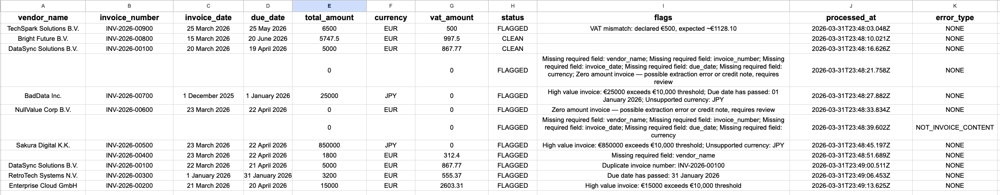
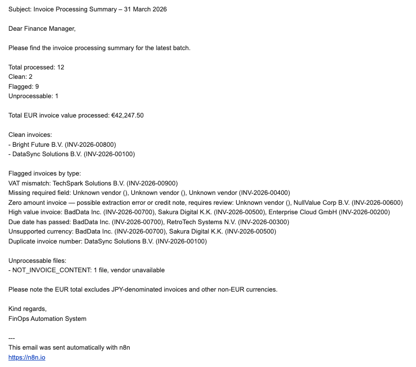
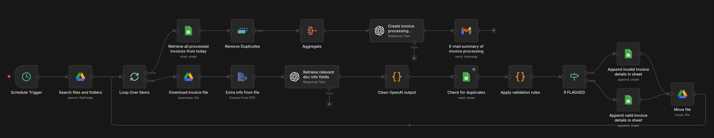
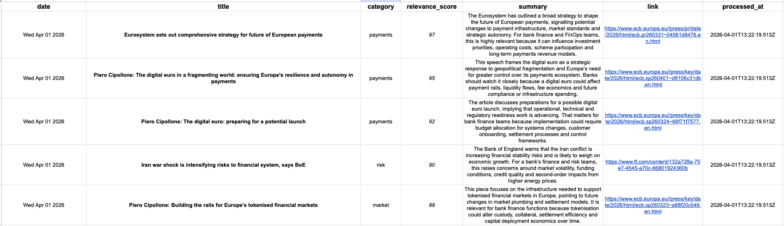
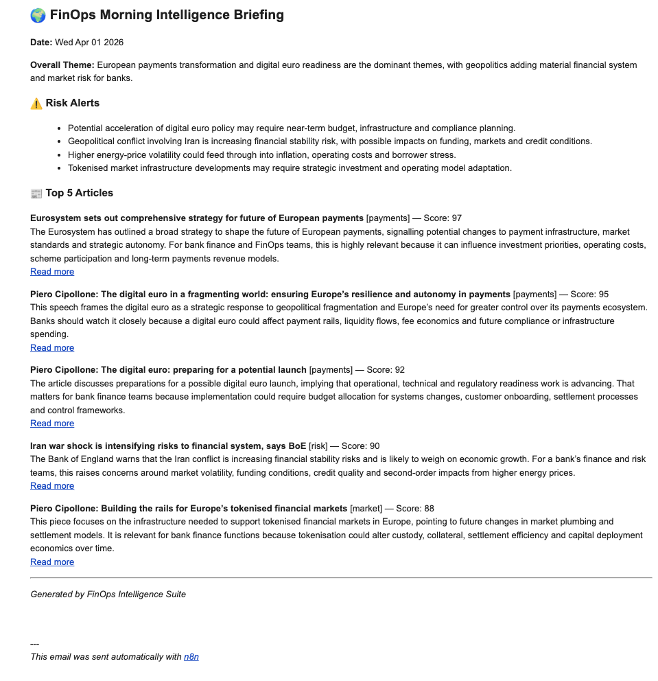

# FinOps: AI Invoice validation & Fintech signals

> An automated financial operations system powered by n8n. Runs validation rules against unprocessed invoices and provides a daily brief of the most relevant developments in the fintech landscape. Built to reduce manual overhead and establish a mini audit trail.

    

---

## Business Problem

Finance teams at banks and financial institutions spend significant time on two repetitive low-value activities:

**1. Manual invoice processing.** Incoming vendor invoices arrive as PDFs. Staff manually open each file, extract key fields, check for errors (wrong VAT, missing fields, past due dates, unsupported currencies), log them to a spreadsheet and escalate exceptions. This is slow, error-prone and produces inconsistent audit trails.

**2. Manual market monitoring.** Staying current with regulatory changes, fintech developments and macroeconomic signals requires reading across multiple sources daily. Most teams either miss important updates or spend too much time filtering noise.

Both problems are well-suited to automation since they involve structured rules, repeatable logic and predictable outputs.

---

## Solution Overview

The FinOps solution consists of two automated workflows that run on a schedule without human intervention:

**Workflow 1 — Invoice Processing Pipeline** watches a Google Drive folder for incoming PDF invoices. For each file, it uses GPT-4o to extract structured data, applies seven validation rules, logs every invoice to an audit trail with its status and flags, sends an immediate alert for flagged invoices and delivers a consolidated daily summary email to the finance manager. Processed files are automatically moved to an archive folder.

**Workflow 2 — Fintech Signals** runs every morning at 8am, fetches articles from financial news RSS feeds (ECB, Financial Times), uses GPT-5.4 to filter and score the five most relevant items for a bank's FinOps team, logs them to an intelligence sheet and delivers a structured HTML briefing email with risk alerts and relevance scores.

Both workflows feed into a shared Google Sheet with two tabs — Invoice Log and Intel Log — creating a single source of truth for finance operations activity.

---

## Architecture

### Workflow 1 — Invoice Processing Pipeline

```
Schedule Trigger
  → Google Drive: Search inbox folder for PDFs
    → Loop Over Items (batch size 1)
      → Download File
        → Extract Text from PDF
          → GPT-4o: Extract structured invoice fields (JSON)
            → Clean OpenAI Output (parsing, errors)
              → Google Sheets: Check for duplicate invoice number
                → Apply Validation Rules (7 rules)
                  → IF FLAGGED
                    → [true]  Append to Invoice Log (status: FLAGGED)
                    → [false] Append to Invoice Log (status: CLEAN)
                  → Google Drive: Move file to /processed
      → [loop done]
        → Google Sheets: Read today's Invoice Log
          → Remove Duplicates
            → Aggregate
              → GPT-5.4: Generate summary email
                → Gmail: Send daily digest to finance manager
```

### Workflow 2 — Fintech Signals

```
Schedule Trigger
  → RSS Feed: ECB press releases
  → RSS Feed: Financial Times Banking
    → Merge
      → Code: Clean and unify article data
        → GPT-5.4: Select top 5, score by relevance, generate summaries + risk alerts
          → Code: Parse response, build HTML email, structure rows
            ├── → Google Sheets: Append 5 rows to Intel Log
            └── → Limit (1 item) → Gmail: Send morning briefing
```

---

## Tech Stack

| Tool | Purpose |
|---|---|
| **n8n** (self-hosted via Docker) | Workflow orchestration |
| **OpenAI GPT** | PDF data extraction, invoice summarisation, article scoring |
| **Google Drive** | Invoice inbox and processed archive |
| **Google Sheets** | Audit log and intelligence log |
| **Gmail** | Alerts and digest emails |
| **Python + ReportLab** | Test invoice PDF generation |
| **Docker** | Local n8n runtime |

---

## Screenshots

### Invoice Processing Pipeline


### Invoice Processing Google Sheet


### Invoice Processing Summary Email


### Fintech Signals


### Fintech Signals Google Sheet


### Fintech Signals Summary Email



---

## Getting Started

### Prerequisites

- [Docker Desktop](https://www.docker.com/products/docker-desktop/)
- Python 3.10+
- OpenAI API key (add ~$5 credit at platform.openai.com)
- Google account with Drive and Sheets access
- Gmail account for sending alerts

### Run n8n locally

```bash
docker run -it --rm --name n8n -p 5678:5678 \
  -v ~/.n8n:/home/node/.n8n \
  n8nio/n8n
```

Open `http://localhost:5678` in your browser.

### Generate test invoices

```bash
# Clone the repo
git clone https://github.com/YOUR_USERNAME/finops-automation.git
cd finops-automation

# Create and activate virtual environment
python -m venv venv
source venv/bin/activate        # Mac/Linux
venv\Scripts\activate           # Windows

# Install dependencies
pip install -r scripts/requirements.txt

# Generate all 12 test PDFs
python scripts/generate_invoices.py
```

PDFs are saved to `samples/invoices/`. Upload them to your Google Drive inbox folder to trigger the pipeline.

### Configure workflows

**Step 1 — Set up Google credentials in n8n**
- Go to n8n Settings → Credentials
- Add Google Sheets OAuth2 credential
- Add Google Drive OAuth2 credential
- Add Gmail OAuth2 credential
- Add OpenAI API credential

**Step 2 — Create Google Drive folders**
- Create `/invoices-inbox` folder in Google Drive
- Create `/invoices-processed` folder in Google Drive
- Copy both folder IDs from their URLs (everything after `/folders/`)

**Step 3 — Create Google Sheet**
- Create a new Google Sheet named `Invoice and Intel Logs`
- Add two tabs: `Invoice Log` and `Intel Log`
- Invoice Log columns: `vendor_name | invoice_number | invoice_date | due_date | total_amount | currency | vat_amount | status | flags | processed_at | error_type`
- Intel Log columns: `date | title | category | relevance_score | summary | link | processed_at`
- Copy the Sheet ID from the URL

**Step 4 — Import and configure workflows**
- In n8n, go to Workflows → Import
- Import `workflows/invoice_pipeline.json`
- Import `workflows/fintech_signals.json`
- In each workflow, replace all `YOUR_*` placeholders:

| Placeholder | Where to find it |
|---|---|
| `YOUR_INVOICES_INBOX_FOLDER_ID` | Google Drive folder URL |
| `YOUR_INVOICES_PROCESSED_FOLDER_ID` | Google Drive folder URL |
| `YOUR_GOOGLE_SHEET_ID` | Google Sheets URL |
| `YOUR_EMAIL_ADDRESS` | Your Gmail address |
| `YOUR_INTEL_LOG_TAB_ID` | Sheet URL after `gid=` on Intel Log tab |

**Step 5 — Activate**
- Open each workflow in n8n
- Toggle the switch from **Inactive** to **Active**
- Upload PDFs to your inbox folder and watch the pipeline run

---

## Validation Rules

The invoice pipeline applies seven validation rules to every processed document:

| Rule | Condition | Flag |
|---|---|---|
| Missing fields | Any of: vendor name, invoice number, dates, currency is empty | `Missing required field: [field]` |
| High value | Total amount > €10,000 | `High value invoice: €X exceeds €10,000 threshold` |
| Past due date | Due date is before today | `Due date has passed: [date]` |
| Unsupported currency | Currency not in EUR, USD, GBP | `Unsupported currency: [currency]` |
| Duplicate invoice | Invoice number already exists in audit log | `Duplicate invoice number: [number]` |
| VAT mismatch | Declared VAT deviates from expected 21% by more than €1 | `VAT mismatch: declared €X, expected ~€Y` |
| Zero amount | Total is €0 and document parsed successfully | `Zero amount invoice — possible extraction error` |

Invoices that trigger any rule are routed to the flagged branch, logged with their flags and included in the daily summary email grouped by flag type.

**Error types** assigned during PDF parsing:

| error_type | Meaning |
|---|---|
| `NONE` | Document parsed successfully |
| `NOT_INVOICE_CONTENT` | Scanned image or non-invoice document |
| `NO_CONTENT` | Empty or corrupted file |
| `PARSE_FAILED` | Malformed or unreadable content |

---

## What I'd Build Next

**Duplicate detection improvement** — The current implementation queries the Invoice Log at processing time. A more robust approach would use invoice embeddings to catch near-duplicate invoices (same vendor, slightly different amounts or dates) that exact matching would miss.

**SAP integration** — Replace the Google Drive trigger with a direct connection to SAP's `API_SUPPLIERINVOICE_PROCESS_SRV` OData endpoint. Clean invoices would be posted directly as vendor invoice documents, eliminating manual data entry entirely.

**Human-in-the-loop approval** — Add a Slack or email-based approval step for flagged invoices above a configurable threshold. The finance manager receives a structured message with Approve / Reject buttons that feed back into the workflow.

**Power BI dashboard** — Connect the Google Sheet audit log to Power BI for live reporting on processing volumes, flag rates by type, vendor anomaly patterns and processing time trends.

**Multi-language invoice support** — The current GPT-4o prompt handles English invoices well. Adding explicit language detection and per-language extraction prompts would support Dutch, German and French vendor invoices common in European finance operations.

**Production hosting** — Deploy n8n to a cloud server (Railway, Render, or AWS EC2) so workflows run 24/7 without requiring a local machine to be on.

---

## Project Structure

```
finops-automation/
├── README.md
├── .gitignore
├── LICENSE
├── workflows/
│   ├── invoice_processing_pipeline.json
│   └── fintech_signals.json
├── scripts/
│   ├── generate_invoices.py
│   └── requirements.txt
├── samples/
│   └── invoices/
├── architecture/
│   ├── fintech_signals_canvas.png
│   └── invoice_processing_canvas.png
└── results/
    ├── Invoice and Intel Logs.xlsx
    └── screenshots/
        ├── invoice_processing/
        │   ├── invoice_processing_excel.png
        │   └── invoice_processing_gmail.png
        └── fintech_signals/
            ├── fintech_signals_excel.png
            └── fintech_signals_gmail.png
```

---

*Built with n8n, OpenAI GPT-4o, Google Workspace and Python.*